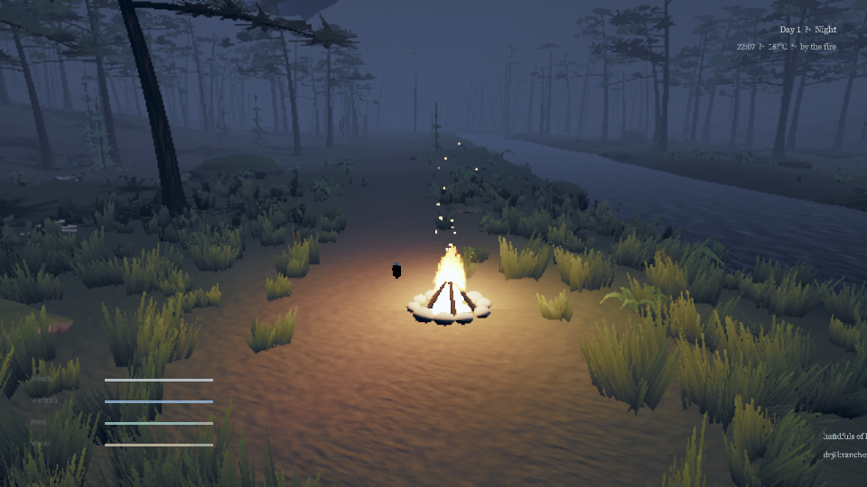

# Mistpine

An original third-person forest-survival vertical slice. It is written in **C++20**, rendered
through **bgfx**, and runs in the browser (compiled to **WebAssembly** with Emscripten) and on
Windows, Linux and macOS as portable native builds. SDL3 handles the window, input and audio.
JavaScript is only a thin bootstrap shell (loading overlay and fatal-error messaging); every menu,
the HUD and all game logic are C++. No game engine is used.



> Screenshots are captured by the automated QA matrix (`scripts/qa_matrix.sh`) in headless Chromium
> with **software** WebGL2 (SwiftShader) at the `low` preset, 960×540, because that is the only
> renderer available in the build sandbox. They show what the renderer produces. They do not show
> performance, and a GPU at `high` looks better.

## The slice

A misty East-Asian mountain valley: pine forest, bamboo groves, mossy limestone, a stream, and an
abandoned shrine on a terrace up the valley. The pass is closed behind you, and a day lasts 30 real
minutes.

- **Survive the cold.** Air temperature follows the day (about 1 °C before dawn, about 10 °C in the
  afternoon). Wading soaks you, and being wet makes you colder. Health drains when warmth, food or
  water run out. A hard fall hurts.
- **Gather and forage.** Dry branches, flint, berries and mushrooms. Picked spots regrow over time.
- **Make fire.** Three branches plus flint (**F**). A fire warms, lights the night and keeps
  predators away. Feed it with **E** or it burns down to ash.
- **Drink** from the stream (**E**), **eat** with **R**.
- **Wolves** roam the valley and howl at night. They stalk lone travellers but fear fire and avoid
  the shrine. A bite hurts. There is no combat: the answer is fire or the shrine.
- **Rest at the shrine** (**E**) to set your waking point and save. If you collapse, you wake at your
  last rest point, weakened. There is no hard game over.
- **Save:** versioned JSON (format **v4**, with v1/v2/v3 migration and validation). In the browser it
  lives in `localStorage`; natively it is a file in the platform's preferences directory. It saves
  automatically every 45 s of play, on pause, on rest and when the window loses focus. The title
  screen offers *Continue* or *Start a new journey*.
- **Settings** (in the pause menu): quality, master volume, mouse sensitivity, invert Y, and
  fullscreen on desktop. They persist across restarts.
- **Audio:** fully procedural, synthesised in C++: wind, the stream, birds by day, crickets by night,
  fire crackle, footsteps by surface, wolves, the shrine bell.

### Controls

| | Keyboard / mouse | Gamepad |
|---|---|---|
| Move / look | W A S D / mouse | left / right stick |
| Run / walk slowly | Shift / Ctrl | left stick click / — |
| Jump / crouch | Space / C | South / East button |
| Interact (gather, drink, feed fire, rest) | E | West button |
| Build a fire | F | North button |
| Eat | R | Right shoulder |
| Camera distance | mouse wheel | |
| Pause | Esc | Start |

### URL options

`?quality=low|medium|high` · `?hours=0..24` (time-of-day override) · `?new=1` (discard the saved
journey) · `?debug=1` (diagnostics overlay, toggled with F3; hidden and disabled otherwise) ·
`?play=1` (skip the title screen) · `?bench=1` (deterministic benchmark route; JSON result in
`window.__mistpineBench`) ·
`?qa=spawn|character|dusk|dawn|camp|shrine|wolves` (fixed-framing visual-QA scenarios).

## Downloads and how to run

Every desktop artifact is **portable**: extract it and run it, with no installer and no build step.

| Artifact | Platform | How to run |
|---|---|---|
| `mistpine-v0.1.0-web.zip` | any (static web host) | Upload the four files to any static host and open `index.html`. |
| `mistpine-v0.1.0-web-singlefile.html` | Chrome | Double-click the file, or open it with `file://`. One self-contained HTML — no server needed. |
| `mistpine-v0.1.0-windows-x64.zip` | Windows x64 (Windows 10 or later) | Unzip, then run `Mistpine.exe`. |
| `mistpine-v0.1.0-linux-x86_64.AppImage` | Linux x86_64 | `chmod +x mistpine-v0.1.0-linux-x86_64.AppImage`, then run it. |
| `mistpine-v0.1.0-linux-x86_64.tar.gz` | Linux x86_64 | `tar xzf mistpine-v0.1.0-linux-x86_64.tar.gz`, then run `mistpine`. |
| `mistpine-v0.1.0-macos-arm64.zip` | macOS (Apple silicon) | Unzip, then open `Mistpine.app`. |

**First-run warnings — these builds are unsigned.**

- **Windows:** SmartScreen may warn. Choose **More info → Run anyway**.
- **macOS:** the app is **ad-hoc signed, not notarized**. Use **right-click → Open**, or
  **System Settings → Privacy & Security → Open Anyway**.

The Windows build links the C runtime statically, so it carries no compiler runtime DLLs, but
it does import the Windows Universal CRT (`api-ms-win-crt-*`), which ships with the operating
system from Windows 10 onwards — so Windows 10 or later is the floor for that artifact. The
release pipeline asserts this: `scripts/pe_deps.py` reads the executable's import table on every
Windows build and fails on any dependency that is not an OS component.

`SHA256SUMS.txt` covers every other release asset.

**Play in the browser:** the web build is deployed to GitHub Pages once Pages is enabled for the
repository — <https://coderunknow.github.io/AAA/>. (Enabling Pages is a repository setting; if that
URL 404s, Pages has not been switched on yet.)

## Building

Everything builds from the command line with CMake presets and Ninja. Dependencies (bgfx.cmake and
SDL3) are pinned to exact commits in `cmake/Dependencies.cmake` and fetched from GitHub.

```bash
# one-shot: tools -> native headless tests -> web release (needs emsdk 4.0.11 activated)
./scripts/build.sh

# or step by step
cmake --preset tools && cmake --build --preset tools --target shaderc      # host shader compiler
cmake --preset native-headless -DSDL_UNIX_CONSOLE_BUILD=ON
cmake --build --preset native-headless && ctest --preset native-headless   # unit tests + smoke runs
EMSCRIPTEN_ROOT=$EMSDK/upstream/emscripten cmake --preset web-release
cmake --build --preset web-release
python3 -m http.server -d build/web-release/src/app 8080                   # open http://localhost:8080
```

Other presets: `native-dev` (windowed, OpenGL/X11 on Linux), `native-release` (packaged desktop
builds), `web-dev` (assertions), `web-profile` and `web-singlefile`.

Shader profiles are compiled for the backend each target needs: `essl` (web/WebGL2), `glsl` (Linux
OpenGL), `spirv` (Vulkan), `dx11` (Windows, `-p s_5_0`) and `metal` (macOS). A missing profile is a
hard error — there is no silent fallback. The dx11 profile is produced by a Windows-built shaderc in
CI, because a Linux shaderc cannot emit SM 5.0.

Useful command-line options: `--headless`, `--frames N`, `--quality low|medium|high`,
`--hours 0..24`, `--qa <scenario>`, `--bench [path]`, `--assets <path>`, `--screenshot <png>` and
`--renderer d3d11|vulkan|opengl|metal|noop`.

## Architecture

Each module is a small purpose-built library. Gameplay never depends on bgfx or SDL, so it is
unit-tested natively. The native and web builds share every line except the platform glue.

| Module | Path | Responsibility |
|---|---|---|
| Core | `src/core` | math, RNG, noise, logging |
| World | `src/world` | terrain fields, valley layout, stream, shrine layout, scatter, chunk streaming |
| Procgen | `src/procgen` | procedural meshes (vegetation, rocks, shrine, campfire) and textures |
| Game | `src/game` | player controller, camera, procedural skeletons and gaits with foot IK, survival, interactables, wildlife AI, save format |
| Audio | `src/audio` | procedural soundscape synthesiser (ambience beds and one-shots) |
| Render | `src/render` | bgfx renderer: cascaded shadows, terrain, instanced foliage/props, GPU-skinned characters, water, fire, sky/fog, bloom, sun shafts, SSAO, FXAA, ACES tonemap |
| Platform | `src/platform` | SDL3 window/input mapping, audio device, key-value storage, web bridge |
| App | `src/app` | staged loading, in-engine UI (menus, HUD, settings, toasts), event routing, autosave |
| Shaders | `shaders/` | bgfx `.sc` shaders, compiled offline by shaderc |
| Tests | `tests/` | 63 unit tests plus 3 headless smoke runs (CTest) |
| QA | `tools/browser` | headless-Chromium playtest harness: scripted input, screenshots, console capture |

Asset provenance: [`docs/ASSETS.md`](docs/ASSETS.md). Design history and verification log:
[`DESIGN_LOG.md`](DESIGN_LOG.md).

## Verification status (be precise)

| Claim | Status |
|---|---|
| Unit tests (world, survival, save v1→v4 migration, procgen, audio, skinning, UI) | **63 tests, 0 failures**, native |
| Headless smoke runs (day; night with campfire; night with wolves) | **pass** (4/4 CTest): bgfx Noop renderer, so logic and API use only, no pixels |
| Sanitizers (ASan + UBSan) | **pass** in CI on the unit tests and smoke runs |
| Warnings-as-errors (`-Werror`, MSVC `/WX`) | **clean** for all first-party targets |
| Shader profiles | essl, glsl, spirv, metal and dx11 all **compile** in CI |
| Web release build | **built**: `index.wasm` ~2.0 MB, `index.data` ~0.5 MB |
| Browser run (headless Chromium, SwiftShader WebGL2, OpenGL ES 3.0) | **launches and plays**: 0 console errors, scripted playtest and save round trip pass |
| Packaged desktop binaries | **built and smoke-tested from a foreign working directory** on Windows, Linux and macOS runners (dependency audit + exit 0, no error logs) |
| Real render verification | Linux runners capture a screenshot under xvfb + Mesa llvmpipe. Windows and macOS runners have no usable GPU, so **no pixels were verified there** |
| Screenshots in `docs/qa/` | **captured** by the automated QA matrix, 0 console errors. They are release evidence for the owner to inspect — the agent cannot view images |
| WebGPU | **not used and not claimed.** The web build runs bgfx's WebGL2 (GLES 3.0) backend |
| Performance | **not measured on real hardware.** About 1 frame/s under software rendering on 2 CPU cores, which says nothing about GPU performance |
| Audio | synthesiser **unit-tested**; the device opens. **Not listened to** by a human |

## Known limitations

- A residual leg-motion discontinuity remains on a few frames where a gesture or crouch state
  changes at a walk (not a NaN, sliding foot or IK failure). See `DESIGN_LOG.md` #14.
- macOS builds are ad-hoc signed, **not notarized**; unsigned Windows builds may trigger SmartScreen.
- Deferred graphics items: distant tree impostors, distant mountain silhouettes, water refraction,
  shore foam, campfire smoke, heat shimmer and TAA. See `DESIGN_LOG.md` #15.
- Under `file://` the single-file build is playable, but the browser may refuse `localStorage`; in
  that case the game tells you once and continues without saving.
- No weather system beyond the valley mist and the day/night cycle.
