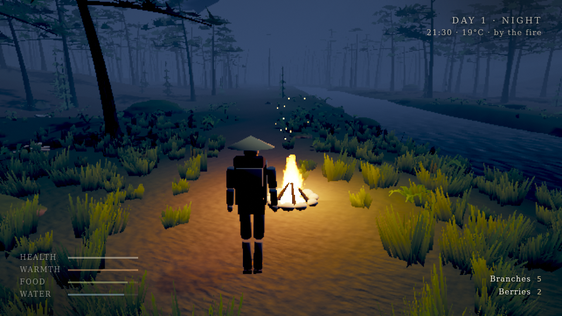

# Mistpine

An original third-person forest-survival vertical slice for the desktop browser. It is written in
**C++20**, rendered through **bgfx**, and compiled to **WebAssembly** with Emscripten. SDL3 handles
the window, input and audio. JavaScript is only the thin HTML shell (loading screen, menus, HUD text).
No game engine is used.



> All screenshots were taken in headless Chromium with **software** WebGL2 (SwiftShader) at the
> `low` quality preset and 960×540, because that is the only renderer in the build sandbox. They show
> what the renderer produces. They do not show performance, and a GPU at `high` looks better.

## The slice

A misty East-Asian mountain valley: pine forest, bamboo groves, mossy limestone, a stream, and an
abandoned shrine on a terrace up the valley. The pass is closed behind you, and a day lasts 30 real minutes.

- **Survive the cold.** Air temperature follows the day (about 1 °C before dawn, about 10 °C in the
  afternoon). Wading soaks you, and being wet makes you colder. Health drains when warmth, food or water
  run out. A hard fall hurts.
- **Gather and forage.** Dry branches, flint, berries and mushrooms. Picked spots regrow over time.
- **Make fire.** Three branches plus flint (**F**). A fire warms, lights the night and keeps predators
  away. Feed it with **E** or it burns down to ash.
- **Drink** from the stream (**E**), **eat** with **R**.
- **Wolves** roam the valley and howl at night. They stalk lone travellers but fear fire and avoid the
  shrine. A bite hurts. There is no combat: the answer is fire or the shrine.
- **Rest at the shrine** (**E**) to set your waking point and save. If you collapse, you wake at your
  last rest point, weakened. There is no hard game over.
- **Save:** versioned JSON in `localStorage` (format v3, with v1/v2 migration and validation). It saves
  automatically every 45 s of play, on pause, on rest and when the tab loses focus. The title screen offers
  *Continue* or *Start a new journey*.
- **Audio:** fully procedural, synthesised in C++: wind, the stream, birds by day, crickets by night, fire
  crackle, footsteps by surface, wolves, the shrine bell.

### Controls

| | Keyboard / mouse | Gamepad |
|---|---|---|
| Move / look | W A S D / mouse | left / right stick |
| Run / walk slowly | Shift / Ctrl | left stick click / — |
| Jump / crouch | Space / C | South / East button |
| Interact (gather, drink, feed fire, rest) | E | West button |
| Build a fire | F | North button |
| Eat | R | Right shoulder |
| Camera distance | mouse wheel | |
| Pause | Esc | Start |

### URL options

`?quality=low|medium|high` · `?hours=0..24` (time-of-day override) · `?new=1` (discard the saved
journey) · `?debug=1` (diagnostics overlay, toggled with F3; it is hidden and disabled otherwise) ·
`?qa=camp|shrine|wolves` (visual-QA setups used by the automated screenshots).

## Building

Everything builds from the command line with CMake presets and Ninja. Dependencies (bgfx.cmake and
SDL3) are pinned to exact commits in `cmake/Dependencies.cmake` and fetched from GitHub.

```bash
# one-shot: tools -> native headless tests -> web release (needs emsdk 4.0.11 activated)
./scripts/build.sh

# or step by step
cmake --preset tools && cmake --build --preset tools --target shaderc      # host shader compiler
cmake --preset native-headless -DSDL_UNIX_CONSOLE_BUILD=ON
cmake --build --preset native-headless && ctest --preset native-headless   # unit tests + smoke runs
EMSCRIPTEN_ROOT=$EMSDK/upstream/emscripten cmake --preset web-release
cmake --build --preset web-release
python3 -m http.server -d build/web-release/src/app 8080                   # open http://localhost:8080
```

Other presets: `native-dev` (windowed, OpenGL/X11 on Linux), `web-dev` (assertions) and `web-profile`.
GitHub Actions (`.github/workflows/ci.yml`) builds all of them with the official emsdk 4.0.11 and
deploys `main` to GitHub Pages once Pages is enabled for the repository.

## Architecture

Each module is a small purpose-built library. Gameplay never depends on bgfx or SDL, so it is
unit-tested natively. The native and web builds share every line except the platform glue.

| Module | Path | Responsibility |
|---|---|---|
| Core | `src/core` | math, RNG, noise, logging |
| World | `src/world` | terrain fields, valley layout, stream, shrine layout, scatter, chunk streaming |
| Procgen | `src/procgen` | procedural meshes (vegetation, rocks, shrine, campfire) and textures |
| Game | `src/game` | player controller, camera, animation, survival, interactables, wildlife AI, save format |
| Audio | `src/audio` | procedural soundscape synthesiser (ambience beds and one-shots) |
| Render | `src/render` | bgfx renderer: cascaded shadows, terrain, instanced foliage/props, water, characters, fire, sky/fog, ACES tonemap |
| Platform | `src/platform` | SDL3 window/input mapping, audio device, key-value storage (localStorage / files), web bridge |
| App | `src/app` | staged loading, title/pause flow, event routing, HUD feed, autosave |
| Shaders | `shaders/` | bgfx `.sc` shaders, compiled offline by shaderc to GLSL ES 3.00 (web) and the native backends |
| Tests | `tests/` | 42 unit tests plus 3 headless smoke runs (CTest) |
| QA | `tools/browser` | headless-Chromium playtest harness: scripted input, screenshots, console capture |

Asset provenance: [`docs/ASSETS.md`](docs/ASSETS.md). Every asset is generated in code. Design
history and verification log: [`DESIGN_LOG.md`](DESIGN_LOG.md).

## Verification status (be precise)

| Claim | Status |
|---|---|
| Unit tests (world, survival, save v1→v3 migration, procgen, audio) | **42 tests, 0 failures**, native |
| Headless smoke runs (day; night with campfire; night with wolves) | **pass**: bgfx Noop renderer, so logic and API use only, no pixels |
| Web release build | **built**: index.wasm 1.8 MB, index.js 0.22 MB, index.data 64 KB |
| Browser run (headless Chromium 153, SwiftShader WebGL2, OpenGL ES 3.0 backend) | **launched and visually inspected**: title, day, night campfire, shrine, night wolf; 0 console errors |
| Save round trip in a real browser (pause → reload → *Continue* → restored) | **verified** (`playtest.mjs --script persist`) |
| Native windowed build | not built here (no display or GL in the sandbox); compiled in CI |
| Audio | synthesiser **unit-tested** (finite, bounded, audible, voices expire); the WebAudio device opens in the browser. **Not listened to** by a human yet |
| WebGPU | **not used and not claimed.** The web build runs bgfx's WebGL2 (GLES 3.0) backend |
| Performance | **not measured on real hardware.** About 1 frame/s under software rendering on 2 CPU cores, which says nothing about GPU performance |

## Known limitations

- Characters and wolves are rigid-part procedural figures with code-driven animation, not skinned
  meshes. They are the largest visual gap from the cinematic target.
- Pine crowns are card-based and read flat from directly below. Distant mountains are simple.
- No weather system beyond the valley mist and the day/night cycle.
- No real-GPU frame-time data yet. Quality presets are tuned by inspection only.
